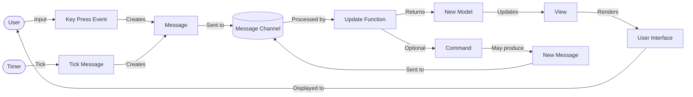
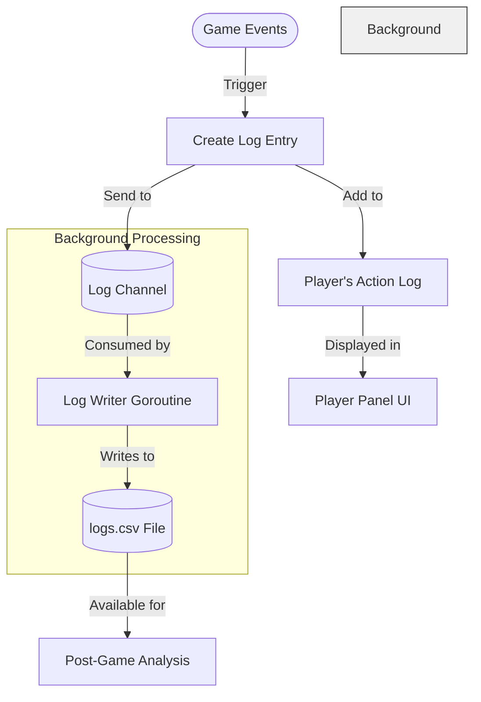

# Model-View-Update (MVU) Architecture in Hammerclock

Hammerclock is built using the Model-View-Update (MVU) architectural pattern, a unidirectional data flow pattern popularized by the [Elm programming language](https://guide.elm-lang.org/architecture/). This architecture provides predictability, maintainability, and testability.

## Overview

The MVU pattern consists of three key components:

1. **Model**: Represents the application state
2. **View**: Renders the UI based on the model
3. **Update**: Handles events and updates the model

## Implementation in Hammerclock

### Model

The model represents our entire application state. All data needed by the application is stored in the model. The model is defined in `internal/hammerclock/common/types.go` and initialized in `internal/hammerclock/model.go`.

```go
// Model represents the entire application state
type Model struct {
    // Game state
    Players             []*Player
    Phases              []string
    GameStatus          GameStatus // Current game status, in progress, paused etc.
    CurrentScreen       string // Can be "main", "options", or "about"
    GameStarted         bool // Indicates if the game has started
    Options             options.Options
    CurrentColorPalette palette.ColorPalette
    TotalGameTime       time.Duration // Total elapsed time for the entire game
}
```

### View

The view is responsible for rendering the UI based on the current model. The view is completely derived from the model. No UI state is stored in the view itself; all state comes from the model. The view is defined in `internal/hammerclock/view.go`.

```go
// View represents the main UI structure of the application.
type View struct {
    App                   *tview.Application    // The main tview application instance.
    MainView              *tview.Flex           // The main container for the UI layout.
    PlayerPanelsContainer *tview.Flex           // Container for player panels.
    PlayerPanels          []*tview.Flex         // List of individual player panels.
    TopMenu               *tview.TextView       // The top menu bar.
    BottomMenu            *tview.TextView       // The bottom menu bar.
    StatusPanel           *tview.Flex           // Panel displaying the current game status.
    ClockDisplay          *tview.TextView       // Text view for displaying the clock.
    OptionsScreen         *tview.Grid           // Grid layout for the options screen.
    AboutScreen           *tview.Flex           // Flex layout for the about screen.
    MessageChan           chan<- common.Message // Channel for sending messages to the application.
    CurrentScreen         string                // Tracks the currently displayed screen.
}
```

The view is composed of several UI components organized in the `internal/hammerclock/ui` directory:

1. **PlayerPanel**: Displays player information, time, and action log (`ui/PlayerPanel.go`)
2. **StatusPanel**: Shows the current game status (`ui/StatusPanel.go`)
3. **AboutPanel**: Displays information about the application (`ui/AboutPanel.go`)
4. **OptionsPanel**: Allows configuration of game settings (`ui/OptionsPanel.go`)
5. **MenuBar**: Provides navigation and control options (`ui/MenuBar.go`)
6. **Clock**: Displays the current time (`ui/clock.go`)

The `Render` method updates the UI based on the current model:

```go
func (v *View) Render(model *common.Model) {
    // Update UI components based on the model state
}
```

### Update

The update component handles all events and state changes. It receives messages representing user actions or system events and returns a new model and a command to execute. This ensures that all state changes go through a single pipeline. The update logic is defined in `internal/hammerclock/update.go`.

```go
// Update processes a message and returns an updated model and a command to execute
func Update(msg common.Message, model common.Model) (common.Model, Command) {
    switch msg := msg.(type) {
    case *common.StartGameMsg:
        return handleStartGame(model)
    case *common.EndGameMsg:
        return handleEndGame(model)
    // Additional message handlers...
    }
}
```

## Unidirectional Data Flow

The data in Hammerclock flows in one direction:

1. The **Model** stores the application state
2. The **View** renders the UI based on the current model
3. User actions trigger **Messages**
4. Messages are processed by the **Update** function
5. The Update function returns a new **Model** and optional **Command**
6. The cycle repeats with the new model

This unidirectional flow makes the application more predictable, testable, and easier to reason about.

## Message System

Communication between components is done through a strongly-typed message system defined in `internal/hammerclock/common/messages.go`. When a user interaction occurs, a message is created and sent to the update function through a channel. The update function processes the message and returns a new model and an optional command to execute.

```go
// Example message types from common/messages.go
type StartGameMsg struct{}
type EndGameMsg struct{}
type KeyPressMsg struct {
    Key  tcell.Key
    Rune rune
}
type SetRulesetMsg struct {
    Index int
}
```

### Message Flow Diagram

The following diagram illustrates the message flow in Hammerclock:



This unidirectional flow ensures that all state changes are processed through a single pipeline, making the application more predictable and easier to reason about.

## Commands

In addition to updating the model, the update function can return a command to be executed after the model update. Commands are functions that can produce new messages, allowing for side effects like timers, network calls, or other asynchronous operations.

```go
// Command represents a Command that can be executed after an update
type Command func() common.Message

// noCommand is a Command that does nothing
func noCommand() common.Message {
    return nil
}
```

## Immutable Updates

State changes in Hammerclock are immutable. Rather than modifying the existing model, each update function creates a new copy of the model with the changes applied. This ensures that no side effects occur during updates and makes the application more predictable.

```go
// Example of an immutable update
func handleSetRuleset(msg *common.SetRulesetMsg, model common.Model) (common.Model, Command) {
    newModel := model  // Create a copy
    newModel.Options.Default = msg.Index  // Modify the copy
    newModel.Phases = model.Options.Rules[msg.Index].Phases
    return newModel, noCommand  // Return the new model
}
```

## Project Structure

The Hammerclock project follows a modular directory structure:

| Directory                      | Purpose                   |
|--------------------------------|---------------------------|
| `cmd/hammerclock`              | Application entry point   |
| `internal/hammerclock`         | Core application logic    |
| `internal/hammerclock/common`  | Shared types and messages |
| `internal/hammerclock/config`  | Application configuration |
| `internal/hammerclock/logging` | Game session logging      |
| `internal/hammerclock/options` | User options management   |
| `internal/hammerclock/palette` | Color theme definitions   |
| `internal/hammerclock/rules`   | Game rule definitions     |
| `internal/hammerclock/ui`      | UI components             |

## Benefits

- **Predictability**: State changes are centralized and follow a clear path
- **Testability**: Functions are pure and can be tested in isolation
- **Maintainability**: Components are decoupled and have clear responsibilities
- **Reasoning**: The application flow is easier to understand
- **Debugging**: State changes are tracked through a single pipeline

## Logging System

Hammerclock includes a comprehensive logging system that records player actions and game events. The logging system is implemented in `internal/hammerclock/logging/logging.go`.

```go
// LogEntry represents a single log entry with details about an action.
type LogEntry struct {
    DateTime   string
    PlayerName string
    Turn       int
    Phase      string
    Message    string
}
```

### Logging Flow Diagram

The following diagram illustrates the flow of log entries in Hammerclock:



This buffered logging approach allows the application to record detailed game events without blocking the main UI thread, ensuring smooth performance even with frequent log entries.

## Potential future Improvements

- Introduce more granular message types for specific state changes
- Implement deeper immutability for nested state objects
- Support for exporting logs in multiple formats
- Add descriptions into the ruleset and every phase, displaying them in the UI
- Add game logos into the rulesets
