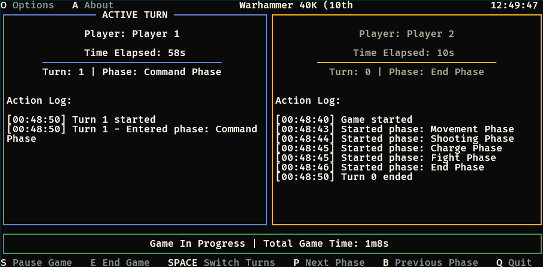

# Hammerclock

A terminal-based UI (TUI) [chess clock](https://en.wikipedia.org/wiki/Chess_clock) and phase tracker application for tabletop games. It is designed with Warhammer 40K, Age of Sigmar, and other tabletop war games in mind, but can be used for any game that requires a timer and phase tracking.



## Features

- Support for multiple players with customizable player names
- Track total elapsed time and individual time for each player
- Track and manage game phases for each player
- Bundled predefined rulesets
- Customizable game rules and phases
- Multiple color palettes
- Logging for game sessions

## Installation

Download the latest release from the [GitHub repository](https://github.com/itworks99/hammerclock).

## Running

By default, the application searches for the options file (`default.json`) in the current directory. You can specify a different configuration file by using the `-o` flag.

```bash
./hammerclock                     # Run with default options
./hammerclock -o /path/to/config.json   # Run with custom options
```

## Configuration

The application uses a JSON configuration file (default: `default.json`) to define its settings. The file has the following basic structure:

```json
{
  "default": 0,
  "rules": [ {} ],
  "playerCount": 2,
  "playerNames": [
    "Player 1",
    "Player 2"
  ],
  "colorPalette": "warhammer",
  "timeFormat": "AMPM",
  "loggingEnabled": true
}
```

### General Configuration Options

| Option           | Description                         | Values                                               |
|------------------|-------------------------------------|------------------------------------------------------|
| `default`        | Index of the default ruleset to use | Integer (index in the rules array)                   |
| `playerCount`    | The number of players in the game   | Integer                                              |
| `playerNames`    | The names of the players            | Array of strings (must match `playerCount`)          |
| `colorPalette`   | The UI color theme to use           | `k9s`, `dracula`, `monokai`, `warhammer`, `killteam` |
| `timeFormat`     | Time display format                 | `AMPM` or `24h`                                      |
| `loggingEnabled` | Enable or disable session logging   | `true` or `false`                                    |

## Game Rules

The `rules` section in the configuration file defines the different game rulesets available in Hammerclock. Each ruleset includes:

```json
{
  "rules": [
    {
      "name": "Warhammer 40K (10th Edition)",
      "phases": [
        "Command Phase",
        "Movement Phase",
        "Shooting Phase",
        "Charge Phase",
        "Fight Phase",
        "End Phase"
      ],
      "oneTurnForAllPlayers": false
    },
    {
      "name": "Chess",
      "phases": [],
      "oneTurnForAllPlayers": true
    }
  ]
}
```

### Rule Configuration Options

| Option                 | Description                                 | Values                                          |
|------------------------|---------------------------------------------|-------------------------------------------------|
| `name`                 | The name of the game ruleset                | String                                          |
| `phases`               | List of game phases specific to the ruleset | Array of strings                                |
| `oneTurnForAllPlayers` | Whether all players take one turn together  | `true` or `false` (useful for games like Chess) |

## Logs

Game logs are written to `logs.csv` in the application directory, providing a record of game duration, phases, and player times.

## Architecture

For details on the application's Model-View-Update (MVU) architecture, see the [ARCHITECTURE.MD](ARCHITECTURE.MD) file.

## Contributing

For details on how to contribute to the project, see the [CONTRIBUTING.MD](CONTRIBUTING.MD) file.

## License

Hammerclock is open source software. Please see the project repository for licensing information.
